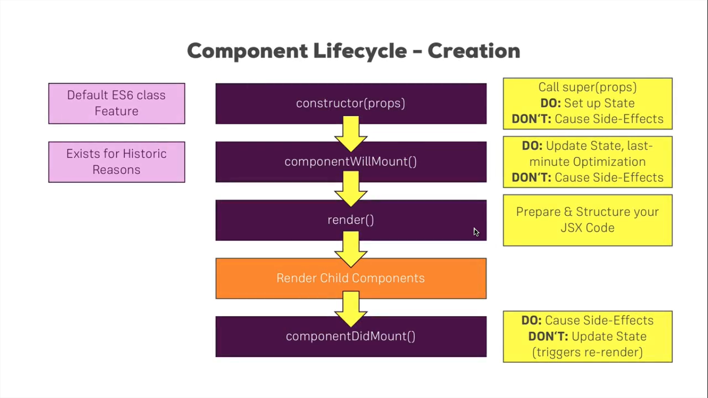
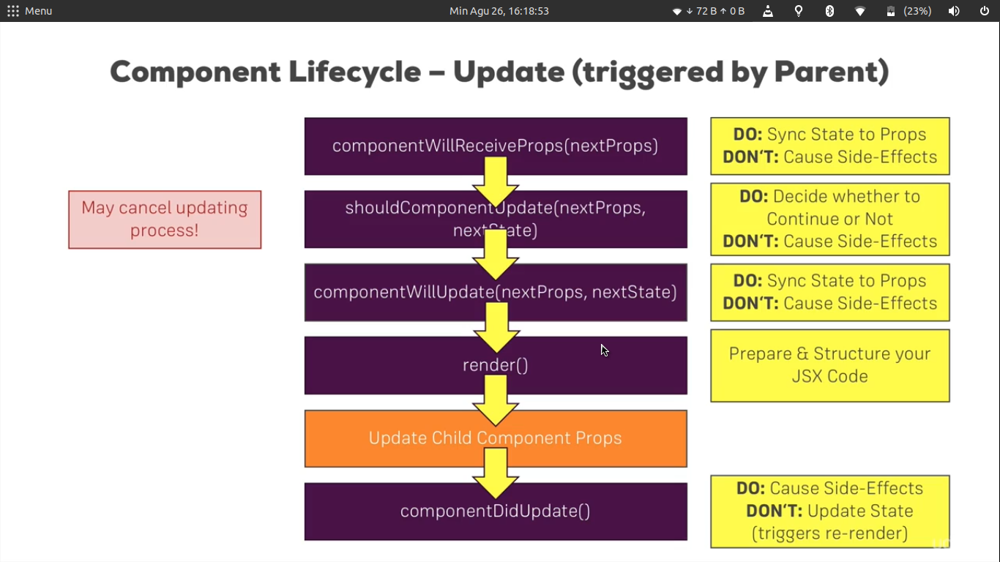

# Learn React Http Request & React Router

## Rangkuman Belajar

## Permulaan
- Untuk mendapatkan sample dari API dengan respon `.json`, bisa diakses di https://jsonplaceholder.typicode.com/
- Untuk http requestnya menggunakan package `axios`. 
see documentation axios at https://github.com/axios/axios


### Kapan waktu terbaik melakukan request data?

#### Inisiasi Component
Lihat pada component lifecycle,
<center>
  
</center>

dari `lifecycle` tersebut, waktu terbaik untuk melakukan `SIDE EFFECT` atau `request data` dari endpoint tertentu adalah pada saat `componentDidMount()`. Kok bisa? baca dokumentasi reactnya,
> componentDidMount() is invoked immediately after a component is mounted (inserted into the tree). Initialization that requires DOM nodes should go here. If you need to load data from a remote endpoint, this is a good place to instantiate the network request.

See more: https://reactjs.org/docs/react-component.html#componentdidmount

#### Updated Component
<center>
  
</center>

sama halnya melakukan request di inisiasi component. Saat melakukan update component (kasus `fetch` detail data by id post) perlu dipertimbangkan `component lifecycle update`-nya. Jika dilihat pada gambar diatas, maka sesi terbaik adalah saat `componentDidUpdate()` dan tentu harus dipertimbangkan berbagai kondisi agar saat melakukan set state tidak berulang tanpa ada hentinya.

```js
 // sample di component FullPost.js
    componentDidUpdate () {
        if(this.props.id) {
            if (this.state.loadedPost && this.state.loadedPost.id === this.props.id) return;
            axios.get('https://jsonplaceholder.typicode.com/posts/' + this.props.id)
                .then(res => {
                    this.setState({ loadedPost: res.data })
                })
                .catch(err => {
                    console.log(err);
                })
        }
    }
```

### Best practice untuk `http request` axios

Ada berbagai cara untuk melakukan request http menggunakan package `axios` di react. bisa langsung menggunakan `import axios from 'axios'`. Tetapi, hal tersebut akan melakukan pengulang - ulangan code. Karena setiap API mungkin mempunya konfigurasi yang berbeda.

- Kalau di Set global? misal di index.js? 
> Tidak bagus juga, karena ya itu, setiap API mungkin memiliki config yang berbeda2. 

- Bagaimana yang terbaik? **Menggunakan Method Instance**

example, `common/api.service.js`
```js
import axios from 'axios';

const http = axios.create({
  baseURL: 'https://jsonplaceholder.typicode.com'
});

http.defaults.headers.common['Authorization'] = 'API-KEY';
http.defaults.headers.post['Content-Type'] = 'application/json';

export default http;
```

baru setelah itu bisa di import di file lain,
```js
import axios from './common/api.service'
// then call axios as reguler way 
```

### React Router
React Router adalah sebuah `package` yang berfungsi untuk menjadikan aplikasi react seperti multipage. example:
```
domain.com/profile
domain.com/users
dan lain sebagainya
```
2 package added for using Routing in react, :
- `npm install -s react-router react-router-dom`

### Absolute Path vs Relative Path
- Absolute path
```
domain: example.com

pathname: this.props.match.url + '/new-post'

hasilnya: example.com/new-post

domain : example.com/new
hasilnya tetep: example.com/new-post
```
- Relative Path
```
example.com

pathname: '/new-post'

hasilnya: example.com/new-post

domain : example.com/new
hasilnya tetep: example.com/new/new-post
```

### Style the Active Link

for styling active route, you can use `NavLink`.
```js
import {Route, NavLink} from 'react-route-dom';

//use? default will be add class="active"
<NavLink to='/new-post'> New Post </NavLink>
// with custom active class?
<NavLink to='/new-post' activeClassName="my-active"> New Post </NavLink>
// with custom styleInline?
<NavLink to='/new-post' activeStyle={{textAlign: 'center'}}> New Post </NavLink>
```

### Route Swicth
```ks
<Switch> 
    <Route path='/profile' component={ Profile}>
    <Route path='/:id' component={ Profile}>
<Switch>
```
Switch akan melakukan rendering route satu kali saja, jadi untuk kasus diatas, sangat cocok diterapkan switch.